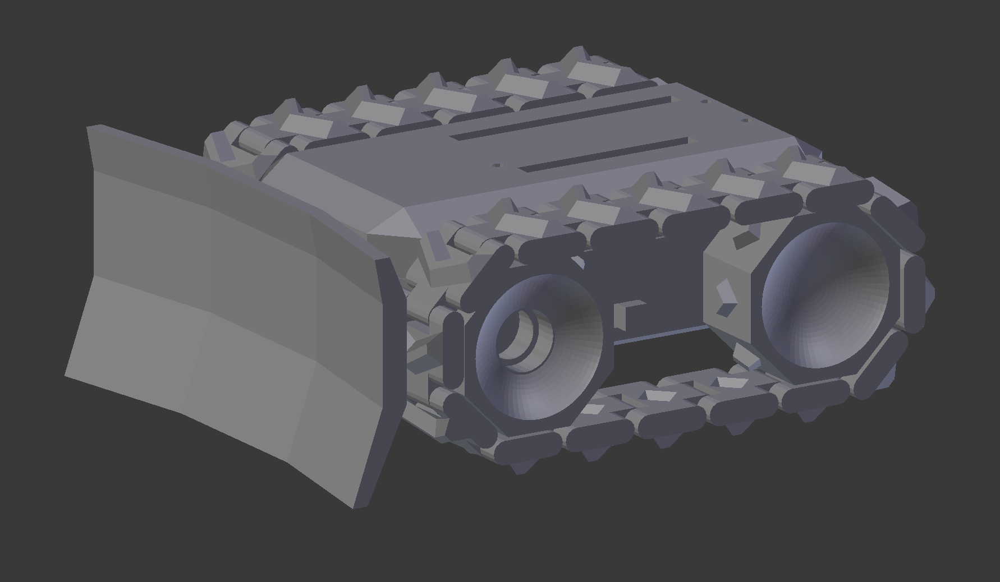

# FeatherRover
A tiny tracked rover using the Adafruit Feather board

## BOM:
https://www.aliexpress.com/item/N20-mini-DC-gear-motor-encoder-gear-motor-GA12-N20-gear-motor-smart-car/32844802758.html

https://www.adafruit.com/product/3406

https://www.pololu.com/product/2135

https://eu.banggood.com/Wholesale-Warehouse-10pcs-623ZZ-3x10x4mm-Ball-Bearings-Shielded-Radial-Bearings-wp-Eu-1049663.html

https://www.electrokit.com/skjutomkopplare-1pol-onon-lodoron.45958

https://www.electrokit.com/batteri-lipo-3-7v-400mah.55259

https://www.electrokit.com/stiftlist-ph-2pol-2-0mm.48271
